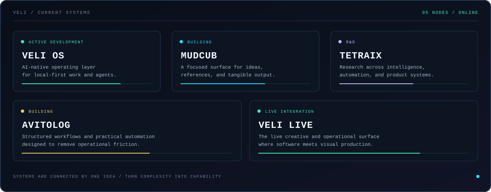
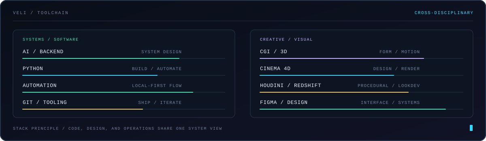
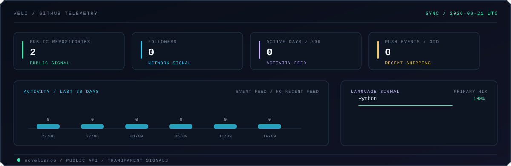

<!--
  VELI PROFILE / README
  Identity system for oovelianoo — Daniil Terekhov.

  The visual layer is intentionally built from local SVG assets so the profile
  stays portable, fast, and independent from a frontend runtime.
-->

<p align="center">
  
</p>

<p align="center">
  <a href="https://github.com/oovelianoo">GITHUB</a>
  &nbsp;&nbsp;·&nbsp;&nbsp;
  <a href="https://t.me/oovelianoo">TELEGRAM</a>
  &nbsp;&nbsp;·&nbsp;&nbsp;
  <a href="./docs/setup.md">SETUP / CUSTOMIZE</a>
</p>

> I build AI-native software systems, creative tools, and local-first workflows where engineering, automation, and visual craft meet.

## /whoami

<p align="center">
  
</p>

I am **Daniil Terekhov** — **VELIAN**, founder of **VELI Technologies**.

My work moves between product strategy and implementation: turning complex workflows into systems, shaping AI-native products, and building the creative infrastructure around them. The common thread is simple — make powerful tools feel clear, useful, and distinctly human.

## /current-systems

<p align="center">
  
</p>

The current VELI ecosystem is a connected set of experiments, products, and infrastructure:

- **VELI OS** — an AI-native operating layer for local-first work and agent systems.
- **MUDCUB** — a focused environment for turning ideas, references, and workflows into tangible output.
- **TETRAIX** — systems research across automation, intelligence, and product infrastructure.
- **Avitolog** — a practical product direction built around structured workflows and useful automation.
- **VELI Live** — the live creative and operational surface where software meets visual production.

## /stack

<p align="center">
  
</p>

The stack is deliberately cross-disciplinary. I use code, design, 3D, and systems thinking as one continuous toolset rather than separate lanes.

## /build-log

```text
VELI BUILD LOG / 2026
──────────────────────────────────────────────────────────────────────────────
01  AI operating systems       designing local-first systems with agentic flow
02  Digital employees           shaping reliable, useful software collaborators
03  CGI pipelines               connecting Cinema 4D, Houdini, and Redshift
04  Creative tooling             making professional workflows feel effortless
05  Product systems              turning complex operations into clear interfaces
──────────────────────────────────────────────────────────────────────────────
STATUS  /  BUILDING IN PUBLIC        PRINCIPLE  /  TURN WORKFLOWS INTO SYSTEMS
```

## /github-telemetry

<p align="center">
  
</p>

The telemetry panel is generated from GitHub's public API by [`scripts/update_telemetry.py`](./scripts/update_telemetry.py). It intentionally shows transparent signals — public repositories, followers, recent activity, and language mix — instead of relying on a third-party stats image or an opaque runtime.

## /contact

If you are building something ambitious at the intersection of software, AI, or visual production, the best place to start is GitHub.

| channel | link |
| --- | --- |
| GitHub | [github.com/oovelianoo](https://github.com/oovelianoo) |
| Telegram | [t.me/oovelianoo](https://t.me/oovelianoo) |
| Profile package | [`docs/setup.md`](./docs/setup.md) |

<p align="center">
  
</p>

<p align="center">
  <sub>VELI SYSTEM ONLINE · BUILD WITH INTENT · SHIP WITH CLARITY</sub>
</p>
